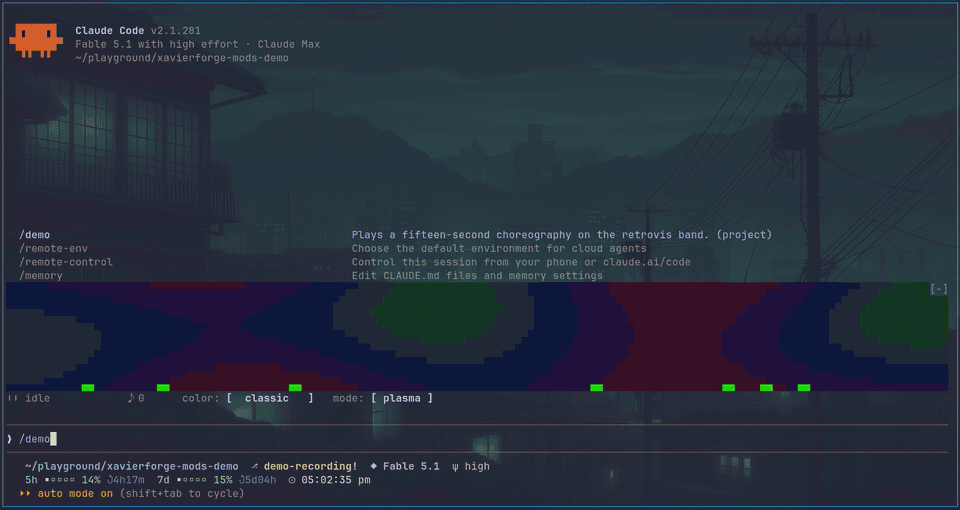
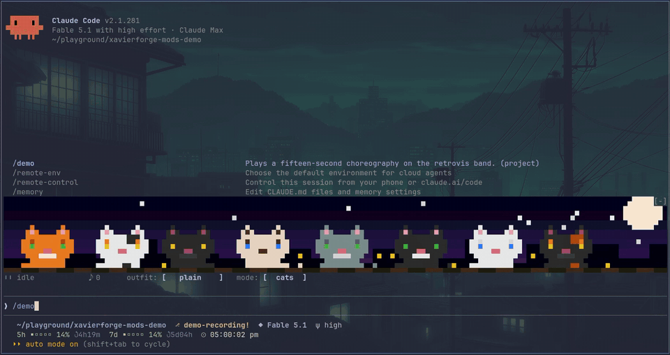

# xavierforge-mods

Claude Code mods built on function hooks. Each one paints the band that
sits over the prompt, each one rides on an early-access feature you have to
switch on yourself, and each one costs zero model tokens once it is up.
`retrovis-mod` is the first of them; more may follow as I find things worth
putting up there.





| mod | the short version |
| --- | --- |
| [retrovis-mod](mods/retrovis-mod/README.md) | A retro media-player visualizer over the prompt: plasma and equalizer bars, or a rooftop of pixel cats dancing to the session. |

Adding a mod to the collection is a folder under `mods/` plus an entry in
`.claude-plugin/marketplace.json`.

## Setup

Two things have to be true before any mod here can draw anything. One,
Claude Code 2.1.278 or newer, which is the version these are built and
type-checked against. Two, function hooks switched on, which today means an
env var:

```json
{ "env": { "CLAUDE_CODE_ENABLE_FUNCTION_HOOKS": "1" } }
```

That block belongs in `~/.claude/settings.json`. If an `env` object is
already sitting there, put the key inside it; a second `env` object next to
the first one will not help. Function hooks are still an early-access
feature, and while the flag is off the engine skips the `modules` entry in a
mod's `hooks.json` altogether, so the mod loads, draws nothing, and says
nothing about it.

One more constraint: the band is an `AbovePrompt` component, which is a
terminal thing. Pipe a prompt through `claude -p`, or open the desktop or
the mobile app, and there is no band for any of this to live in.

With that out of the way, point the CLI at the marketplace, then pick a
scope. Installing from inside a project with `--scope local` keeps the mod
in that one directory; `--scope user` puts it in every project you open on
this machine, and can be run from anywhere:

```sh
claude plugin marketplace add xavierforge/xavierforge-mods

# just this project
cd /path/to/your/project
claude plugin install retrovis-mod@xavierforge-mods --scope local

# or everywhere
claude plugin install retrovis-mod@xavierforge-mods --scope user
```

Every mod here goes in the same way, `claude plugin install
<mod>@xavierforge-mods`, with `retrovis-mod` above as the worked example.

Then quit Claude Code properly and start it again. `/reload-plugins` will
not do: it never re-reads the env block.

Taking a mod back out is those two steps in reverse, with the same scope you
installed under (and from the same project, for a local one):

```sh
claude plugin uninstall retrovis-mod@xavierforge-mods --scope local   # or --scope user
claude plugin marketplace remove xavierforge-mods
```

There is nothing else to sweep up afterwards. These mods write no files of
their own.

## Silent failures

Get the setup wrong and nothing complains, the mod simply is not there. Four
causes, each with its own tell.

**Too old an engine.** `claude --version` prints anything below 2.1.278.

**The flag never arrived.** Run `! echo $CLAUDE_CODE_ENABLE_FUNCTION_HOOKS`
from inside Claude Code. An empty line means this session never saw it, and
the usual reason is a key that ended up in a second `env` object which
shadowed the first.

**A stale session.** The settings file looks right, the echo still comes
back empty, and you edited that file with Claude Code already open. Quit it
all the way and come back.

**The wrong project.** A local install is bound to the directory you ran it
from. `claude plugin list` will tell you the scope and then stop being
helpful, so read the record it wrote:

```sh
grep -n projectPath ~/.claude/plugins/installed_plugins.json
```

Every hit is a directory that some locally scoped plugin was installed
into. If the project you are sitting in is not among them, install again
from here.

## Develop

```sh
claude plugin validate .   # the marketplace manifest
```

Each mod keeps its own validate, test and tsc lines in its own README.

`/plugin-types` writes the generated declarations once, into `.claude/types`
at the repo root, and every mod's `tsconfig.json` reaches back to that one
copy, so a single regeneration after a Claude Code update covers all of
them.

One rule holds across every mod: no `hooks/*.tsx` file may give a local
variable the name `h`. JSX here compiles to `h(...)` calls, so a local `h`
shadows the factory and the band dies on the spot.

## License

MIT, see [LICENSE](LICENSE).
